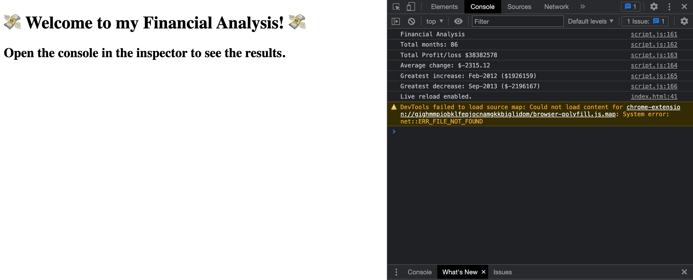

# 04-console-finances
## Description

The purpose of this project was to write a Javascript code to calculate the following information from some pre-provided financial information:

- Total number of months included in the dataset
- The net total amount of Profit/Losses over the entire period
- The greatest increase in profits over the entire period
- The greatest decrease in profits over the entire period

The results are printed to the console.

My motivation for this project was to get to grips with the basics of Javascript and practice declaring variables, using arrays, using concatenation, and using various operators to carry out simple arithmetic whilst looping through the dataset.

The code I have constructed allows a quick and effective way to calculate the required values for a large dataset.

Though this project was challenging and complicated at times, I feel I have consolidated some key aspects of fundamental Javascript code. 

## Installation

N/A

## Usage

To view the financial analysis of the dataset, follow the link to the deployed page:

From there, just open the console within the inspector and you will see the print out of results.

## Credits

I used the following references for this project:
- https://www.w3schools.com/js/js_operators.asp
- https://www.w3schools.com/js/js_loop_for.asp
- https://www.w3schools.com/jsref/jsref_tofixed.asp 
- Javascript A Beginners Guide by John Pollock (5th edition, 2020)
- Begin to Code with Javascript by Rob Miles (2022)
- https://developer.mozilla.org/en-US/docs/Web/JavaScript/Reference/Operators/Addition_assignment

## License

MIT License

---
